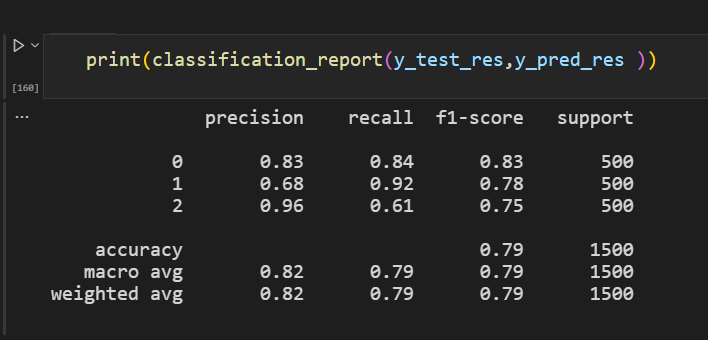
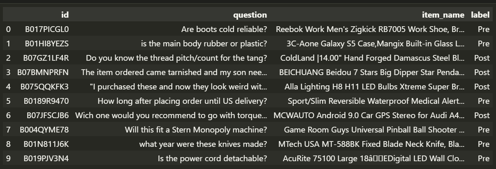

# CNN 3 classes classification using PyTorch and Cuda
In this homework for my deep learning course from MIPT images with 3 categories of animals 
(cats, dogs and wild cat) was classified.   
To do that I used first simple fully connected neural network as baseline and after convolutional neural network to show dramatic 
accuracy increasing. 
Also some tests with number of convolutional layers, dropout, initialisation and optimizers were performed.
To build and train models with less training time on Cuda I used PyTorch framework. 

# LSTM + W2V text binary classification using PyTorch and Cuda
In this homework for my deep learning course from MIPT text questions with 2 categories 
(prepuchase and postpuchase questions) were classified.
As a baseline I used Naive Bayes. Main LSTM+W2V gave a little bit better result than Naive Bayes.
To build and train models with less training time on Cuda I used PyTorch framework. 
